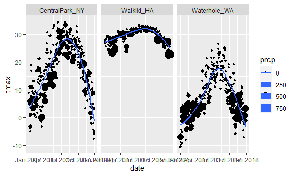
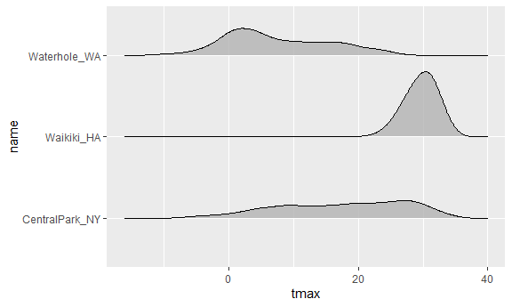
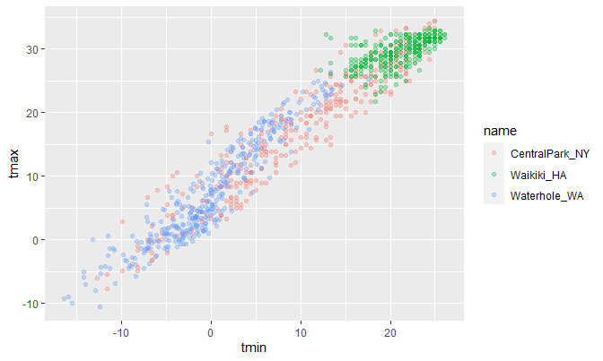

ggplot 1
================
nz2333
10/20/2021

``` r
library(tidyverse)
```

    ## -- Attaching packages --------------------------------------- tidyverse 1.3.1 --

    ## v ggplot2 3.3.5     v purrr   0.3.4
    ## v tibble  3.1.4     v dplyr   1.0.7
    ## v tidyr   1.1.3     v stringr 1.4.0
    ## v readr   2.0.1     v forcats 0.5.1

    ## -- Conflicts ------------------------------------------ tidyverse_conflicts() --
    ## x dplyr::filter() masks stats::filter()
    ## x dplyr::lag()    masks stats::lag()

``` r
knitr::opts_chunk$set(
  fig.width = 6, 
  fig.asp =.6, 
  out.width = "90%"
)
```

load in a datset

``` r
weather_df = 
  rnoaa::meteo_pull_monitors(
    c("USW00094728", "USC00519397", "USS0023B17S"),
    var = c("PRCP", "TMIN", "TMAX"), 
    date_min = "2017-01-01",
    date_max = "2017-12-31") %>%
  mutate(
    name = recode(
      id, 
      USW00094728 = "CentralPark_NY", 
      USC00519397 = "Waikiki_HA",
      USS0023B17S = "Waterhole_WA"),
    tmin = tmin / 10,
    tmax = tmax / 10) %>%
  select(name, id, everything())
```

    ## Registered S3 method overwritten by 'hoardr':
    ##   method           from
    ##   print.cache_info httr

    ## using cached file: C:\Users\Meiei\AppData\Local/Cache/R/noaa_ghcnd/USW00094728.dly

    ## date created (size, mb): 2021-10-20 03:39:25 (7.621)

    ## file min/max dates: 1869-01-01 / 2021-10-31

    ## using cached file: C:\Users\Meiei\AppData\Local/Cache/R/noaa_ghcnd/USC00519397.dly

    ## date created (size, mb): 2021-10-20 03:39:33 (1.701)

    ## file min/max dates: 1965-01-01 / 2020-02-29

    ## using cached file: C:\Users\Meiei\AppData\Local/Cache/R/noaa_ghcnd/USS0023B17S.dly

    ## date created (size, mb): 2021-10-20 03:39:37 (0.914)

    ## file min/max dates: 1999-09-01 / 2021-10-31

## Scatterplot

tmax vs tmin

``` r
weather_df %>%
  ggplot(aes(x = tmin, y = tmax))+
  geom_point()
```

    ## Warning: Removed 15 rows containing missing values (geom_point).


you can save ggplots

``` r
ggp_tamx_tmin = 
  weather_df %>%
  ggplot(aes(x = tmin, y = tmax))+
  geom_point()

ggp_tamx_tmin
```

    ## Warning: Removed 15 rows containing missing values (geom_point).


## fancy it up

add color, lines, and other stuff?

``` r
 weather_df %>%
  ggplot(aes(x = tmin, y = tmax, color = name))+
  geom_point(alpha = .3) +
  geom_smooth(se = FALSE) +
  facet_grid(. ~ name)
```

    ## `geom_smooth()` using method = 'loess' and formula 'y ~ x'

    ## Warning: Removed 15 rows containing non-finite values (stat_smooth).

    ## Warning: Removed 15 rows containing missing values (geom_point).


^alpha: transparency level. smooth: adding the line facet\_grid: make it
separate.

## more scatter plot

``` r
weather_df %>%
  ggplot(aes(x = date, y = tmax, size = prcp)) +
  geom_point(apha = 0.3) +
  geom_smooth(se = FALSE) +
  facet_grid(. ~ name)
```

    ## Warning: Ignoring unknown parameters: apha

    ## `geom_smooth()` using method = 'loess' and formula 'y ~ x'

    ## Warning: Removed 3 rows containing non-finite values (stat_smooth).

    ## Warning: Removed 3 rows containing missing values (geom_point).



## use data manipulation as part of this

``` r
weather_df %>%
  filter(name == "CentralPark_NY") %>%
  mutate(
    tmax = tmax * (9/5) + 32, 
    tmin = tmin * (9/5) + 32
  ) %>%
  ggplot(aes(x = tmin, y = tmax)) +
  geom_point()
```


## stacking geoms

which geoms do you want?

``` r
weather_df %>%
  ggplot(aes(x = date, y = tmax ,color = name)) +
  geom_smooth()
```

    ## `geom_smooth()` using method = 'loess' and formula 'y ~ x'

    ## Warning: Removed 3 rows containing non-finite values (stat_smooth).


``` r
weather_df %>%
  ggplot(aes(x = tmin, y = tmax)) +
  geom_hex()
```

    ## Warning: Removed 15 rows containing non-finite values (stat_binhex).


^this shows how dense data is

## Univariate plots

``` r
weather_df %>%
  ggplot (aes(x = tmax, fill = name)) +
  geom_histogram() +
  facet_grid(. ~ name)
```

    ## `stat_bin()` using `bins = 30`. Pick better value with `binwidth`.

    ## Warning: Removed 3 rows containing non-finite values (stat_bin).


other plots:

``` r
weather_df  %>%
  ggplot(aes(x = tmax, fill = name)) +
  geom_density(alpha = 0.3)
```

    ## Warning: Removed 3 rows containing non-finite values (stat_density).


tamx and name, other ways: boxplot:

``` r
weather_df %>%
  ggplot(aes(x = name, y = tmax)) +
  geom_boxplot()
```

    ## Warning: Removed 3 rows containing non-finite values (stat_boxplot).


violin plots:

``` r
weather_df %>%
  ggplot(aes(x = name, y = tmax)) +
  geom_violin()
```

    ## Warning: Removed 3 rows containing non-finite values (stat_ydensity).


what about ridges:

``` r
library(ggridges)
```

``` r
weather_df %>%
  ggplot(aes(x = tmax, y = name)) +
  geom_density_ridges(alpha = 0.8, scale = 0.8)
```

    ## Picking joint bandwidth of 1.84

    ## Warning: Removed 3 rows containing non-finite values (stat_density_ridges).



## embedding plots

``` r
weather_df %>%
  ggplot(aes(x = tmin, y = tmax, color = name)) +
  geom_point(alpha = 0.3)
```

    ## Warning: Removed 15 rows containing missing values (geom_point).


``` r
weather_df %>%
  ggplot(aes(x = tmin, y = tmax, color = name)) +
  geom_point(alpha = 0.3)
```

    ## Warning: Removed 15 rows containing missing values (geom_point).


^ changing how you are embedding this plot in the r markdown doc.
