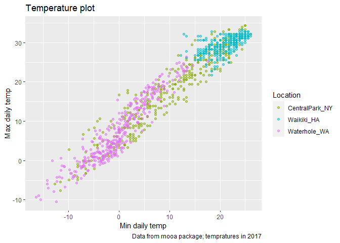

viz\_eda\_part2
================
nz2333
10/20/2021

``` r
library(tidyverse)
```

    ## -- Attaching packages --------------------------------------- tidyverse 1.3.1 --

    ## v ggplot2 3.3.5     v purrr   0.3.4
    ## v tibble  3.1.4     v dplyr   1.0.7
    ## v tidyr   1.1.3     v stringr 1.4.0
    ## v readr   2.0.1     v forcats 0.5.1

    ## -- Conflicts ------------------------------------------ tidyverse_conflicts() --
    ## x dplyr::filter() masks stats::filter()
    ## x dplyr::lag()    masks stats::lag()

``` r
library(patchwork)
```

load weather data

``` r
weather_df = 
  rnoaa::meteo_pull_monitors(
    c("USW00094728", "USC00519397", "USS0023B17S"),
    var = c("PRCP", "TMIN", "TMAX"), 
    date_min = "2017-01-01",
    date_max = "2017-12-31") %>%
  mutate(
    name = recode(
      id, 
      USW00094728 = "CentralPark_NY", 
      USC00519397 = "Waikiki_HA",
      USS0023B17S = "Waterhole_WA"),
    tmin = tmin / 10,
    tmax = tmax / 10) %>%
  select(name, id, everything())
```

    ## Registered S3 method overwritten by 'hoardr':
    ##   method           from
    ##   print.cache_info httr

    ## using cached file: C:\Users\Meiei\AppData\Local/Cache/R/noaa_ghcnd/USW00094728.dly

    ## date created (size, mb): 2021-10-20 03:39:25 (7.621)

    ## file min/max dates: 1869-01-01 / 2021-10-31

    ## using cached file: C:\Users\Meiei\AppData\Local/Cache/R/noaa_ghcnd/USC00519397.dly

    ## date created (size, mb): 2021-10-20 03:39:33 (1.701)

    ## file min/max dates: 1965-01-01 / 2020-02-29

    ## using cached file: C:\Users\Meiei\AppData\Local/Cache/R/noaa_ghcnd/USS0023B17S.dly

    ## date created (size, mb): 2021-10-20 03:39:37 (0.914)

    ## file min/max dates: 1999-09-01 / 2021-10-31

``` r
weather_df %>%
  ggplot(aes(x = tmin, y = tmax, color= name)) +
  geom_point(alpha = 0.5)
```

    ## Warning: Removed 15 rows containing missing values (geom_point).

<!-- -->

## labels

``` r
weather_df %>%
  ggplot(aes(x = tmin, y = tmax, color= name)) +
  geom_point(alpha = 0.5) +
  labs(
    title = "Temperature plot",
    x = "Min daily temp",
    y = "Max daily temp", 
    caption = "Data from rnooa package; tempratures in 2017"
  )
```

    ## Warning: Removed 15 rows containing missing values (geom_point).

<!-- -->

\#\#Scales

``` r
weather_df %>%
  ggplot(aes(x = tmin, y = tmax, color= name)) +
  geom_point(alpha = 0.5) +
  labs(
    title = "Temperature plot",
    x = "Min daily temp",
    y = "Max daily temp", 
    caption = "Data from rnooa package; tempratures in 2017"
  ) +
  scale_x_continuous(
    breaks = c(-15, 0, 15), 
    labels = c("-15 C", "0", "15")
  ) +
  scale_y_continuous(
    trans = "log",
    position = "right"
  )
```

    ## Warning in self$trans$transform(x): NaNs produced

    ## Warning: Transformation introduced infinite values in continuous y-axis

    ## Warning: Removed 90 rows containing missing values (geom_point).

<!-- -->

Look at colors:

``` r
weather_df %>%
  ggplot(aes(x = tmin, y = tmax, color= name)) +
  geom_point(alpha = 0.5) +
  labs(
    title = "Temperature plot",
    x = "Min daily temp",
    y = "Max daily temp", 
    caption = "Data from rnooa package; tempratures in 2017"
  ) +
  scale_color_hue(
    name = "Location", 
    h = c(100, 300))
```

    ## Warning: Removed 15 rows containing missing values (geom_point).

<!-- -->

``` r
weather_df %>%
  ggplot(aes(x = tmin, y = tmax, color= name)) +
  geom_point(alpha = 0.5) +
  labs(
    title = "Temperature plot",
    x = "Min daily temp",
    y = "Max daily temp", 
    caption = "Data from rnooa package; tempratures in 2017"
  ) +
  viridis::scale_color_viridis(name = "Location",
                               discrete = TRUE )
```

    ## Warning: Removed 15 rows containing missing values (geom_point).

<!-- -->

## Themes

Shift the legend

``` r
weather_df %>%
  ggplot(aes(x = tmin, y = tmax, color= name)) +
  geom_point(alpha = 0.5) +
  labs(
    title = "Temperature plot",
    x = "Min daily temp",
    y = "Max daily temp", 
    caption = "Data from rnooa package; tempratures in 2017"
  ) +
  viridis::scale_color_viridis(name = "Location",
                               discrete = TRUE ) +
  theme(legend.position = "bottom")
```

    ## Warning: Removed 15 rows containing missing values (geom_point).

<!-- --> Change the
overall theme

``` r
weather_df %>%
  ggplot(aes(x = tmin, y = tmax, color= name)) +
  geom_point(alpha = 0.5) +
  labs(
    title = "Temperature plot",
    x = "Min daily temp",
    y = "Max daily temp", 
    caption = "Data from rnooa package; tempratures in 2017"
  ) +
  viridis::scale_color_viridis(name = "Location",
                               discrete = TRUE ) +
  theme_minimal() +
  theme(legend.position = "bottom") 
```

    ## Warning: Removed 15 rows containing missing values (geom_point).

<!-- --> ^^must
chaneg overall theme first, then do the legend

## setting options

``` r
library(tidyverse)

knitr::opts_chunk$set(
  fig.width = 6,
  fig.height = 0.6, 
  out.width = "90%"
)
theme_set(theme_minimal() + theme(legend.position = "bottom")
          
options(
  ggplot2.continuous/colour = "viridis", 
  ggplot2.continuous.fill = "viridis"
)

scale_color_discrete = scale_color_viridis_d
scale_fill_discrete = scale_fill_discrete_d
```

^ usually run this at the beginning

## data args in geom

``` r
central_park = 
  weather_df %>%
  filter(name == "CentralPark_NY")

waikiki = 
  weather_df %>%
  filter(name == "Waikiki_HA")

ggplot(data = waikiki, aes(x= date, y = tmax, color = name)) +
  geom_point() +
  geom_line(data = central_park)
```

    ## Warning: Removed 3 rows containing missing values (geom_point).

<!-- -->
